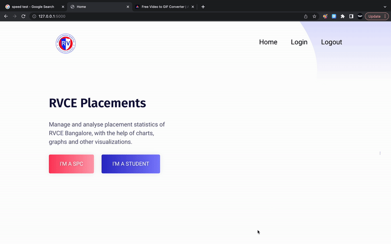

# RVCE Placement Management System

[](https://www.youtube.com/watch?v=wWDMmJrxVUk)

## Steps to Run

1. Create a python virtual environment and install all dependencies listed in ```requirements.txt```. This can be done by using the command ```pip install -r requirements.txt```.
2. Once the dependencies are installed, run the server using ```python app.py```.
3. Change the mongodb uri to your local setup and make required modifications.
4. Go to local host i.e ```http://127.0.0.1:5000``` on your browser to get the application running.
5. To get the discussion forum running, first install the node modules needed by running ```npm -i``` inside Discussion forum directory.
6. Run ```npm start``` inside both the backend and frontend folder to get the forum discussion page running.

## The following are a few snapshots of the application:


 

